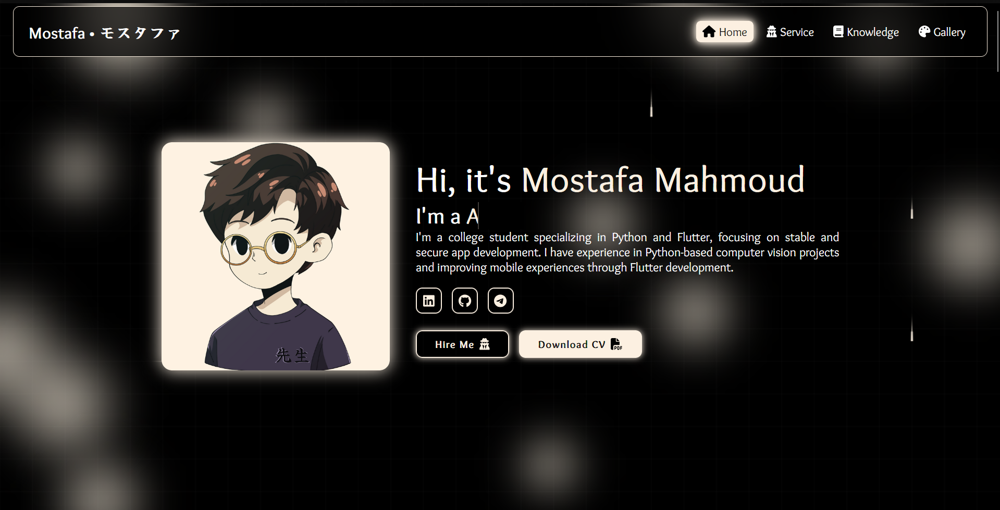
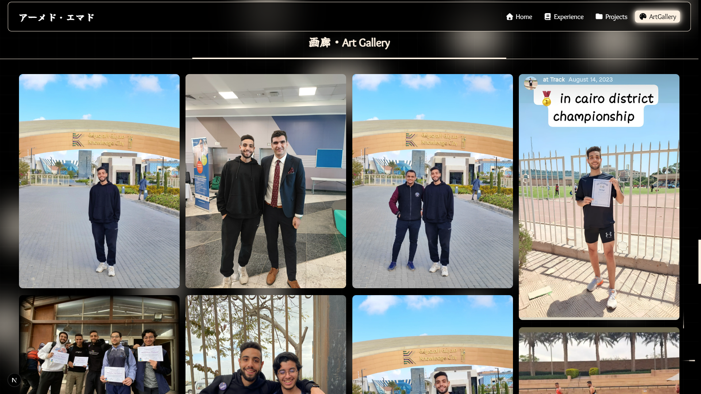

<h1 align="center">Sensei-Dev Portfolio</h1>
<p align="center"></p>
<p align="center">
  <strong>Explore a world of innovative Software Development and creative problem-solving.</strong>
</p>
<p align="center">
  <a href="#about">About</a> •
  <a href="#features">Features</a> •
  <a href="#demo">Demo</a> •
  <a href="#installation">Installation</a> •
  <a href="#technologies">Technologies</a> •
  <a href="#contributing">Contributing</a> •
  <a href="#license">License</a>
</p>

---

## About

Welcome to Sensei-Dev, my personal portfolio showcasing a journey through the realms of Software Development and creative problem-solving. This portfolio is a testament to my skills, projects, and contributions to the open-source community. Dive in to experience an interactive and vibrant showcase of my work!

## Features

🌟 Here are some of the standout features of this portfolio:

1. **Stunning Visual Design**:

   - Visually appealing interface with smooth animations
   - Cohesive color scheme creating a harmonious browsing experience

2. **Fully Responsive Layout**:

   - Seamless experience across all devices - from mobile phones to desktop computers

3. **Interactive Project Showcase**:

   - Explore a diverse range of projects
   - Detailed descriptions and live demos where available

4. **Image Processing**:

   - Dynamic image gallery automatically optimized for performance
   - Custom Python script for converting and adjusting images for web
   - Image compression at various levels
   - Extraction of images from a specified path

5. **Interactive Landing Section**:

   - Attractive and modern design with interactive animations

6. **Specialized Sections**:

   - Services: Clear and organized presentation of offered services
   - Projects: Showcase of past and current projects
   - Education and Languages: Information on educational experiences and language proficiencies
   - Programming Languages: Display of utilized programming languages
   - Image Gallery: Attractive presentation of images and graphics
   - Design: Samples of design work
   - Contact: Form for client communication
   - Footer: Additional information and important links

7. **Customizable Interface**:
   - Easy-to-use customization options to tailor the viewing experience to your preferences

## Screenshots

<p align="center">
  
  
</p>

## Demo

Experience the Sensei-Dev portfolio live:
🚀 [Sensei-Dev Live Demo](https://mostafasensei106.github.io/Sensei-Dev)

## Installation

Get Sensei-Dev up and running on your local machine in just a few steps:

1. Ensure you have [Node.js](https://nodejs.org/en/download/package-manager) installed on your system.
2. Clone the repository:
   ```
   git clone https://github.com/MostafaSensei106/Sensei-Dev.git
   ```
3. Navigate to the project directory and install dependencies:
   ```
   cd Sensei-Dev
   npm install
   ```
4. Install Python requirements:
   ```
   cd app/image_optmization
   pip install -r requirements.txt
   ```
5. Use the Python script for image optimization:
   - Place your images in the designated folder within the `public/Assets/art-gallery/Images/image_display` directory.
   - Run the Python script:
     ```
     python image_optimizer.py
     ```
   - Follow the on-screen instructions to optimize your images.
6. Start the development server:
   ```
   npm run dev
   ```
7. Open your browser and visit `http://localhost:3000` to see the portfolio in action!

## Technologies

This portfolio is built with cutting-edge technologies:

- **Next.js 14**: For server-side rendering and optimal performance
- **TypeScript**: Ensuring type safety and improved developer experience
- **Python**: Powering scripts for image optimization and data processing
- **CSS**: Styling with modern CSS techniques for a polished look

## Contributing

Your contributions are welcome! Here's how you can help improve Sensei-Dev:

1. Fork the repository
2. Create your feature branch: `git checkout -b feature/AmazingFeature`
3. Commit your changes: `git commit -m 'Add some AmazingFeature'`
4. Push to the branch: `git push origin feature/AmazingFeature`
5. Open a pull request

For major changes, please open an issue first to discuss what you would like to change.

## License

This project is licensed under the GPL-3.0 license - see the [LICENSE](LICENSE) file for details.

---

<p align="center">
  Made with ❤️ by <a href="https://github.com/MostafaSensei106">MostafaSensei106</a>
</p>
