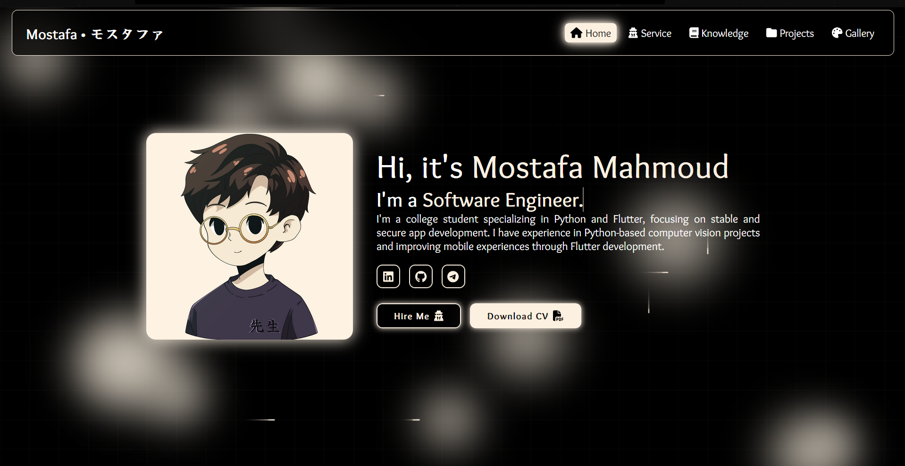
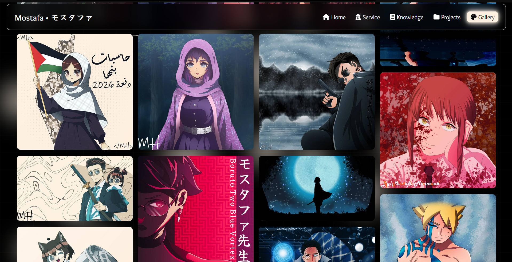

<h1 align="center">Sensei-Dev Portfolio</h1>
<p align="center">
  
</p>

<p align="center">
  <strong>Personal developer portfolio showcasing software engineering projects, mobile apps, and open-source packages.</strong><br>
  Built with Next.js, React, TypeScript, Tailwind CSS, Lenis, and Framer Motion.
</p>

<p align="center">
  <a href="https://mostafasensei106.github.io/Sensei-Dev/">
    
  </a>
  <a href="https://github.com/MostafaSensei106/Sensei-Dev/actions/workflows/nextjs.yml">
    
  </a>
  <a href="https://github.com/MostafaSensei106/Sensei-Dev/blob/master/LICENSE">
    
  </a>
</p>

---

## 📑 Table of Contents

- [About](#-about)
- [Screenshots](#-screenshots)
- [Live Demo](#-live-demo)
- [Features](#-features)
- [Tech Stack](#-tech-stack)
- [Prerequisites](#-prerequisites)
- [Getting Started](#-getting-started)
- [Configuration](#-configuration)
- [Available Scripts](#-available-scripts)
- [Contributing](#-contributing)
- [License](#-license)

---

## 🌟 About

**Sensei-Dev** is my personal portfolio and software development showcase. It highlights my journey as a Mobile and Systems Software Engineer, featuring production applications, open-source packages (such as Quantum-Crypto and Waffle-DB), academic background, and an interactive digital art gallery.

---

## 📸 Screenshots

<p align="center">
  
</p>
<p align="center">
  
</p>

---

## 🚀 Live Demo

Experience the live portfolio:  
👉 **[Sensei-Dev Live Demo](https://mostafasensei106.github.io/Sensei-Dev/)**

---

## ✨ Features

- **Smooth Motion & Clean UI**: Dark theme aesthetic with smooth scrolling powered by Lenis, interactive cards, and subtle transitions with Framer Motion and GSAP.
- **Dynamic GitHub Sync**: Fetches repository stats directly from the GitHub API with a reliable local fallback if offline or rate-limited.
- **Project Showcase**: Highlights for mobile apps, native bridges, and open-source tools with links to code and live stores.
- **Art Gallery with Lightbox**: Interactive gallery featuring full-screen lightbox viewing, image zoom, and category filters.
- **Fully Responsive**: Tailored for smooth browsing across mobile phones, tablets, and desktops.
- **Static Export**: Generates static HTML (`output: "export"`), making it fast to load and easy to host on GitHub Pages or any static CDN.

---

## 🛠 Tech Stack

- **Framework**: Next.js 16 (App Router, Static Export)
- **Frontend**: React 19, TypeScript
- **Styling**: Tailwind CSS v4
- **Smooth Scroll & Animation**: Lenis, Framer Motion, GSAP
- **Components & Icons**: Lucide React, Yet Another React Lightbox
- **Typography**: Outfit, Dela Gothic One, JetBrains Mono, Noto Sans JP, Yuji Syuku
- **Deployment**: GitHub Pages via GitHub Actions

---

## 📋 Prerequisites

> [!TIP]
> Running the project locally is simple and only requires Node.js and a package manager.

- **Node.js**: `20.x` or higher
- **Package Manager**: `npm`, `pnpm`, or `yarn`

---

## 🚀 Getting Started

### 1. Clone the Repository

```bash
git clone https://github.com/MostafaSensei106/Sensei-Dev.git
cd Sensei-Dev
```

### 2. Install Dependencies

```bash
npm install
```

### 3. Start Development Server

```bash
npm run dev
```

Open [http://localhost:3000](http://localhost:3000) in your browser.

### 4. Build for Production

```bash
npm run build
```

This creates an optimized static build in the `./out` directory.

---

## ⚙️ Configuration

All personal information, experience history, and project entries are managed in a single configuration file:

📁 **[`app/core/config/portfolio.ts`](file:///home/ottafa/Devolpments/Sensei-Dev/app/core/config/portfolio.ts)**

You can easily customize:
- **Profile & Contact**: Name, title, social links, email, phone number, and CV link.
- **Experience**: Work history, community roles, and education.
- **Projects**: Pinned GitHub repositories and featured project details.
- **Services & Skills**: Engineering offerings and tech stack items.

---

## 📜 Available Scripts

| Command | Description |
| :--- | :--- |
| `npm run dev` | Starts the Next.js development server at `http://localhost:3000` |
| `npm run build` | Compiles and exports the static site into the `./out` directory |
| `npm run start` | Runs the production build locally (preview mode) |
| `npm run lint` | Runs ESLint to check code quality |

---

## 🤝 Contributing

Contributions, feedback, and suggestions are welcome!

1. Fork the repository.
2. Create your branch: `git checkout -b feature/YourFeature`
3. Commit your changes: `git commit -m "Add some feature"`
4. Push to the branch: `git push origin feature/YourFeature`
5. Open a Pull Request.

---

## ⚖️ License

This project is licensed under the **GPL-3.0 License** - see the [LICENSE](LICENSE) file for details.

<p align="center">
  Made with ❤️ by <a href="https://github.com/MostafaSensei106">MostafaSensei106</a>
</p>
